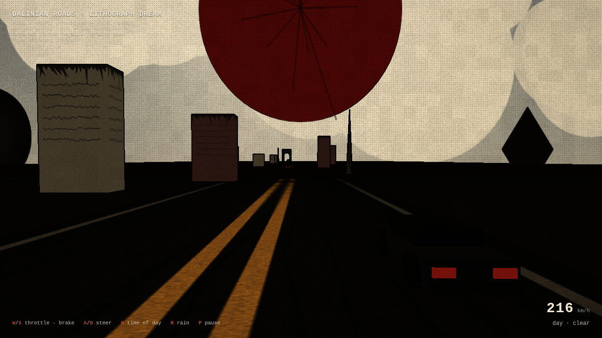
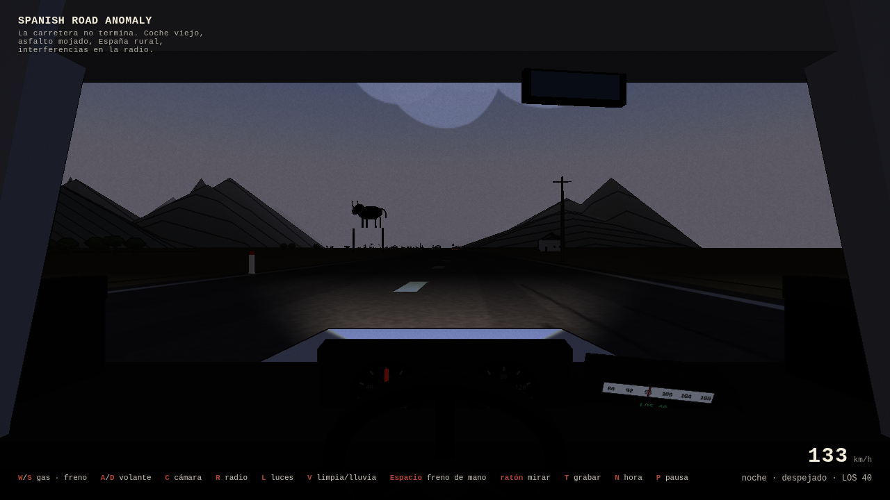

# Dalinian Roads · Lithograph Dream — Fase 0 (prototipo de estilo)

Prototipo jugable en el navegador que fusiona **"Dalinian Roads"** (surrealismo de
carretera tipo Dalí) con **"Lithograph Dream"** (grabado / litografía de alto
contraste), sobre **física de conducción arcade**, **clima** y **ciclo día/noche**.

Es la **Fase 0** recomendada en el informe técnico: un corte vertical de una sola
escena — la composición clave de la imagen de referencia (carretera recta con
doble línea amarilla, coche visto desde atrás, "sol-sello" rojo y siluetas
imposibles en el horizonte) — construido para validar el *look* antes que nada.




## Cómo ejecutar

No hay build. Todo es autocontenido (Three.js va **vendorizado** en `vendor/`, así
que funciona sin conexión). Los módulos ES necesitan servirse por HTTP:

```bash
cd edugrey
python3 -m http.server 8099
# abre http://127.0.0.1:8099/
```

(Abrir `index.html` con `file://` no funciona: el navegador bloquea los módulos ES.)

## Controles

| Tecla | Acción |
|------|--------|
| `W` / `S` | acelerar / frenar |
| `A` / `D` | girar (solo muerde con velocidad; menos agarre bajo lluvia) |
| `N` | ciclar hora del día (día → atardecer → noche) |
| `R` | lluvia on/off |
| `P` | pausa |

## La arquitectura: dos capas desacopladas

Sigue exactamente la tesis central del informe — **el estilo se resuelve en
post-proceso, no en la iluminación**, para que el look gráfico plano y la
simulación dinámica no compitan.

1. **Capa de simulación** (`scene` → render target)
   - Física de coche arcade (throttle/brake/drag, dirección dependiente de la
     velocidad y del agarre, balanceo de carrocería).
   - Carretera euclidiana legible: strip largo con doble amarilla, la textura
     hace scroll para fingir avance; los props se reciclan → conducción infinita.
   - Mid-ground surreal **en 3D real** hacia el que conduces (arco, obelisco,
     losas de collage, rocas, tráfico) + un **skybox-collage plano** con el
     sol-sello, esfera y diamante flotantes, nubes de papel rasgado y montañas.
   - Sombreado **cel** (`MeshToonMaterial` con rampa de 3 bandas duras).

2. **Capa litográfica** (un único pase GLSL3 a pantalla completa)
   - **Contornos de tinta**: discontinuidad de profundidad + sobel de luminancia.
   - **Dither ordenado (Bayer 4×4)**: entinta por trama las zonas de sombra
     (efecto grabado), anclado a `gl_FragCoord` → sin "hervor" temporal.
   - **Grano de papel + mottle + viñeta**.
   - **Grade por hora del día** y **lluvia** (estrías de grafito animadas): se
     mueven *por debajo* del pase de estilo, remapeando lo que recibe el shader
     en vez de pelearse con él.

Todo el arte es **procedural** (texturas dibujadas en `<canvas>`): cero assets
externos, cero dependencias más allá de Three.js vendorizado.

## Legibilidad de la carretera (regla de diseño)

Lo colisionable/jugable (carretera, coches, líneas) va con **máximo contraste y
contornos nítidos**; lo surreal (esfera, diamante, montañas, sol) vive en el
skybox o fuera del corredor navegable y solo "flota" suavemente cuando está lejos
de la calzada. Es la regla "la carretera es real, el mundo no".

## Qué falta (siguientes fases del informe)

- **Fase 2** — validar estabilidad del dither/hatching en un ciclo día/noche
  completo bajo lluvia/niebla en el hardware objetivo (aquí ya se sostiene, pero
  no está medido); probar *hatching* con Tonal Art Maps como alternativa al dither.
- **Fase 3** — playtest de legibilidad de la carretera con curvas reales.
- **Fase 4** — sistema social asíncrono (monólogos de voz como "signos" tipo
  Death Stranding).
- Migración a motor real (UE5 + Chaos Vehicles o Unity + RCC) si el corte de
  estilo convence — ver `docs/DESIGN.md`.

## Estructura

```
index.html                 prototipo completo (sim + post) — Dalinian Roads
juego.html                 aventura de texto — El Juego
vendor/three.module.js      Three.js r160 vendorizado (offline)
docs/preview*.png           capturas
docs/DESIGN.md              diseño técnico condensado desde el informe
```

## El Juego

`juego.html` es una aventura de texto interactiva con estética de consola retro.
Abre el archivo a través del mismo servidor HTTP:

```bash
# http://127.0.0.1:8099/juego.html
```

Toma decisiones que afectan tu vida, energía e inventario y descubre uno de los
múltiples finales.
